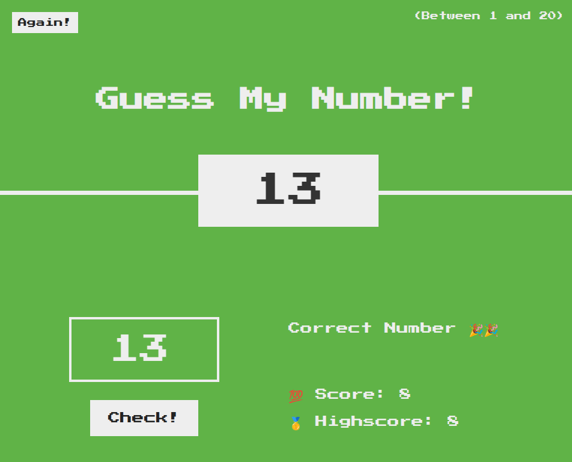

# Number Guessing Game

Welcome to the Number Guessing Game repository! This is a simple yet fun web-based game where players guess a randomly generated number between 1 and 20. The game provides feedback on whether the guess is too high or too low and keeps track of the player's score and high score.

## Preview


## How to Play
1. Start the Game: Open the index.html file in your browser to start the game.

2. Guess the Number: Enter your guess in the input field and click the "Check!" button.

3. Feedback: The game will tell you if your guess is too high, too low, or correct.

4. Win or Lose: If you guess the correct number, you win! If your score drops to 0, you lose the game.

5. Play Again: Click the "Again!" button to reset the game and try again.

## Getting Started
To get started with this project, follow these steps:

1. Clone the Repository:
```bash
git clone https://github.com/eldoJr/guess-my-number-game.git
```
2. Navigate to the Project Directory:
```bash
cd guess-my-number-game
```
3. Open the Game:

Open the index.html file in your browser to play the game.